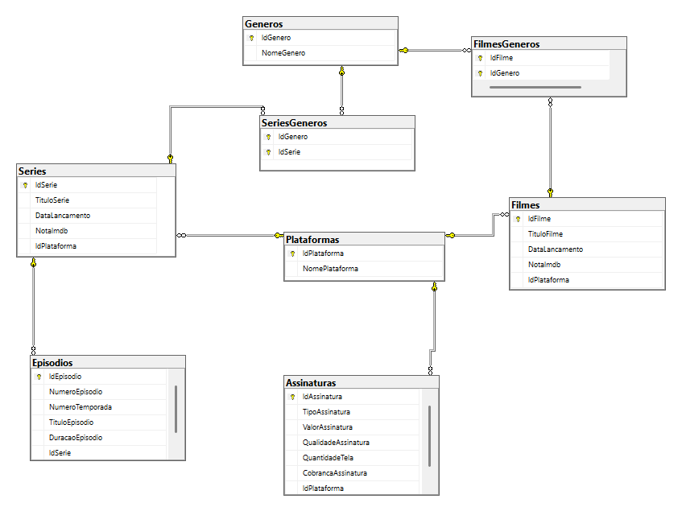

# StreamingDB

Projeto desenvolvido para praticar modelagem de banco de dados relacional e consultas SQL utilizando SQL Server.

## Sobre o Projeto

A StreamingDB simula um sistema de gerenciamento de séries, filmes e assinaturas de streaming, permitindo o cadastro, relacionamento e a análise profunda de informações de catálogo e finanças.
O projeto foi criado com o objetivo de consolidar conhecimentos em modelagem de dados, relacionamentos entre tabelas e desenvolvimento de consultas SQL avançadas orientadas a inteligência de negócios (BI).

## Diagrama Entidade-Relacionamento



## Tecnologias Utilizadas

* SQL Server
* T-SQL
* Git
* GitHub

## Conceitos Aplicados

* Modelagem Relacional (1:N e N:N com tabelas de junção)
* Primary Key e Foreign Key
* Identity, Unique e Check Constraints
* Inner Join, Left Join e Operadores de Conjunto (Union All)
* Group By e Filtros Pós-Agrupamento (Having)
* Funções de Agregação (Sum, Count, Avg, Max)
* Expressões Condicionais (Case When) e Agregações Condicionais
* Subqueries (Subconsultas Independentes e Correlacionadas)

## Estrutura do Projeto

```text
StreamingDB
│
├── Scripts
│   ├── 01_Schema_2.sql
│   ├── 02_Crud_2.sql
│   ├── 03_Relatorio_Negocio_2.sql
│
├── diagrama
│   └── DER-StreamingDB-V3.png
│
└── Readme
    └── README.md