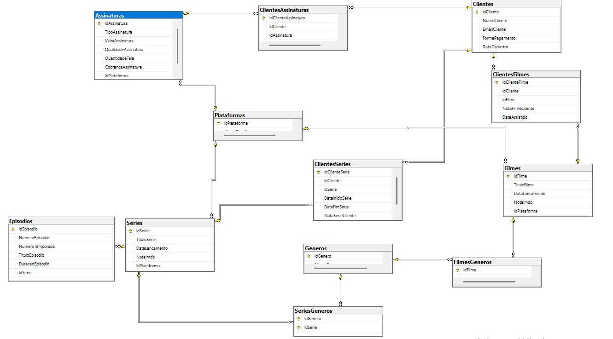
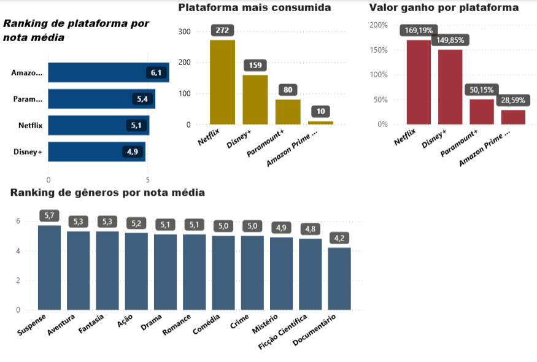

# StreamingDB

Projeto desenvolvido para praticar modelagem de banco de dados relacional e consultas SQL utilizando SQL Server.

## Sobre o Projeto

A StreamingDB simula um sistema de gerenciamento de séries, filmes e assinaturas de streaming, permitindo o cadastro, relacionamento e a análise profunda de informações de catálogo e finanças.
O projeto foi criado com o objetivo de consolidar conhecimentos em modelagem de dados, relacionamentos entre tabelas e desenvolvimento de consultas SQL avançadas orientadas a inteligência de negócios (BI).

## Diagrama Entidade-Relacionamento

## Tecnologias Utilizadas

* SQL Server
* T-SQL
* Git
* GitHub
* Power Bi

## Conceitos Aplicados

* Modelagem Relacional (1:N e N:N com tabelas de junção)
* Primary Key e Foreign Key
* Identity, Unique e Check Constraints
* Inner Join, Left Join e Operadores de Conjunto (Union All)
* Group By e Filtros Pós-Agrupamento (Having)
* Funções de Agregação (Sum, Count, Avg, Max)
* Expressões Condicionais (Case When) e Agregações Condicionais
* Subqueries (Subconsultas Independentes e Correlacionadas)
* procedures

## Estrutura do Projeto

StreamingDB
│
├── Scripts
│   ├── 01_Schema.sql
│   ├── 02_Crud.sql
│   ├── 03_Relatorio_Negocio.sql
│   ├── 04_Relatorio_PowerBI.sql
│   ├── 05_Relatorio_PowerBI_Clientes.sql
│   ├── 06_procedures.sql
├── Imagens-DER-BI
│   └── DER-StreamingDB_V5.png
│   ├── dashboard_01.png
│   ├── Dashboard_02.png
│
│─── DashBoard
│   └── 01_Dashboard_StreamingDB.pbix
│   └── Dashboard-Cliente-02.pbix
└── Readme
│    └── README.md

## Business Intelligence & Dashboard (Power BI)

Para complementar a análise técnica dos scripts SQL, foi desenvolvido um painel interativo no Power BI conectado ao banco de dados `StreamingDB`. O objetivo é transformar as consultas de negócios em indicadores visuais e acionáveis (KPIs).

## Indicadores Monitorados:
* **Faturamento por Plataforma**: Soma das assinaturas ativas de clientes.
* **Evolução Mensal**: Volume de novas assinaturas realizadas ao longo do tempo.
* **Engajamento de Catálogo**: Nota média das séries filtradas por gênero.
* **Perfil do Consumidor**: Distribuição das formas de pagamento preferidas pelos clientes.

## Dashboard 02 — Comportamento e Consumo dos Clientes

Além da visão financeira e operacional da plataforma, foi desenvolvido um segundo painel no Power BI, focado exclusivamente no comportamento dos clientes: o que eles assistem, como avaliam o conteúdo e quais plataformas concentram o maior volume de consumo.

Enquanto o primeiro dashboard responde "como a empresa está indo", este responde "o que os clientes realmente consomem e preferem" — uma virada de perspectiva de negócio para perspectiva de usuário.

## Indicadores Monitorados:
* **Ranking de Plataformas por Nota Média**: Posição de cada plataforma com base na avaliação média dos clientes em séries e filmes combinados.
* **Ranking de Gêneros por Nota Média**: Gêneros mais bem avaliados pelos clientes, cruzando séries e filmes.
* **Plataforma Mais Consumida**: Ranking por volume total de títulos assistidos (séries + filmes), indicando engajamento de conteúdo.
* **Plataforma com Maior Faturamento**: Ranking das plataformas por receita gerada em assinaturas.

